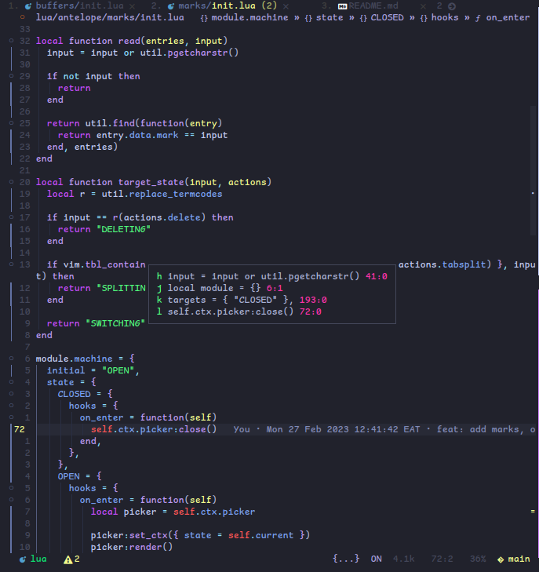

# antelope

buffers / marks switcher for [Neovim](https://github.com/neovim/neovim).

#### Marks


#### Buffers


### Requirements
- [Neovim](https://github.com/neovim/neovim) >= 0.6
- [nvim-web-devicons](https://github.com/kyazdani42/nvim-web-devicons) (optional)

### Installation

Using [Lazy](https://github.com/folke/lazy.nvim)
```lua
  return {
     'Pheon-Dev/antelope'
  }
```

Using [packer.nvim](https://github.com/wbthomason/packer.nvim)
```lua
use 'Pheon-Dev/antelope'
```

Using [vim-plug](https://github.com/junegunn/vim-plug)
```vim
Plug 'Pheon-Dev/antelope'
```

### Setup

```lua
-- default config
require('antelope').setup({
  notifications = true
})
```

### Usage

#### buffers

```lua
-- default
local options = {
  handle = 'auto',              -- 'bufnr' or 'dynamic' or 'auto'
  show_icons = true,
  show_current = false,         -- Include current buffer in the list
  show_modified = true,         -- Show buffer modified indicator
  modified_icon = '⬤',          -- Character to use as modified indicator
  grayout_current = true,       -- Wheter to gray out current buffer entry
  force_delete = {},            -- List of filetypes / buftypes to use
                                -- 'bdelete!' on, e.g. { 'terminal' }
  filter = nil,                 -- Function taking bufnr as parameter,
                                -- returning true or false
  sort = nil,                   -- Comparator function (bufnr, bufnr) -> bool
  terminal_char = '\\',         -- Character to use for terminal buffer handles
                                -- when options.handle is 'dynamic'
  grayout = true,               -- Gray out non matching entries

  -- A list of characters to use as handles when options.handle == 'auto'
  auto_handles = require('antelope.buffers.constant').auto_handles,
  auto_exclude_handles = {},    -- A list of characters not to use as handles when
                                -- options.handle == 'auto', e.g. { '8', '9', 'j', 'k' }
  previous = {
    enable = true,              -- Mark last used buffers with specified chars and colors
    depth = 2,                  -- Maximum number of buffers to mark
    chars = { '•' },            -- Characters to use as markers,
                                -- last one is used when depth > #chars
    groups = {                  -- Highlight groups for markers,
      'String',                 -- last one is used when depth > #groups
      'Comment',
    },
  },
  -- A map of action to key that should be used to invoke it
  actions = {
    split = '-',
    vertsplit = '|',
    tabsplit = ']',
    delete = '<Space>',
    priority = '=',
  },
}

require('antelope').buffers(options)

-- Example keymapping
vim.keymap.set('n', '<leader>rb', function() require('antelope').buffers(buffer_options) end, {})
```

or command with default options applied:

```
Antelope buffers
```

When window is open:

- type in the buffer handle to switch to that buffer, `<CR>` required if `options.handle` == 'bufnr' and there are further matches
- press `<Space>` to start deleting buffers, if `options.handle` == 'bufnr' a prompt accepting space separated list of bufnrs is displayed
- press `|` to split buffer vertically
- press `-` to split buffer horizontally
- press `]` to open buffer in a new tab

If `options.handle` == 'auto':

- press `=` to start assigning priorities to buffers. Buffers with higher priority (1 is higher priority than 2) will have their handles assigned first. This is persistent for each `cwd`. Set priority to `<Space>` to remove it.

#### marks

```lua
-- default
local options = {
  filter = function(mark)
    return mark:match('[a-zA-Z]') -- return true to disable
  end,
  -- A map of action to key that should be used to invoke it
  actions = {
    split = '-',
    vertsplit = '|',
    tabsplit = ']',
    delete = '<Space>',
  },
}

require('antelope').marks(options)
```

or command with default options applied:

```
Antelope marks
```

When window is open:
- type in the mark handle to jump to that mark
- press `<Space>` to start deleting marks
- press `|` to split mark vertically
- press `-` to split mark horizontally
- press `]` to open mark in a new tab

#### Instant switching to nth buffer

```lua
-- options as in require('antelope').buffers(options)
require('antelope').switch_to_buffer(n, options)
```

### Highlights

```
AntelopeBorder             -> 'Comment'
AntelopeDirectory          -> 'Directory'
AntelopeModifiedIndicator  -> 'String'
AntelopeHandleBuffer       -> 'String'
AntelopeHandleDelete       -> 'Error'
AntelopeHandleSplit        -> 'Directory'
AntelopeTail               -> 'Normal'
AntelopeHandleMarkLocal    -> 'Type'
AntelopeHandleMarkGlobal   -> 'Number'
AntelopeMark               -> 'Normal'
AntelopeMarkLocation       -> 'Comment'
AntelopeHandleTabpage      -> 'TabLineSel'
AntelopeGrayOut            -> 'Comment'
AntelopeMatchExact         -> 'String'
AntelopePriority           -> 'Special'
AntelopeCurrent            -> 'Title'

-- Example
vim.api.nvim_set_hl(0, "AntelopeBorder", { fg = "#44475a", bg = "#21222c" })
vim.api.nvim_set_hl(0, "AntelopeMarkLocation", { fg = "#ff33a8" })
vim.api.nvim_set_hl(0, "AntelopeHandleMarkLocal", { fg = "#50fa7b", bg = "#21222c" })
vim.api.nvim_set_hl(0, "AntelopeMark", { fg = "#a9b1d6", bg = "#2122c" })
```
